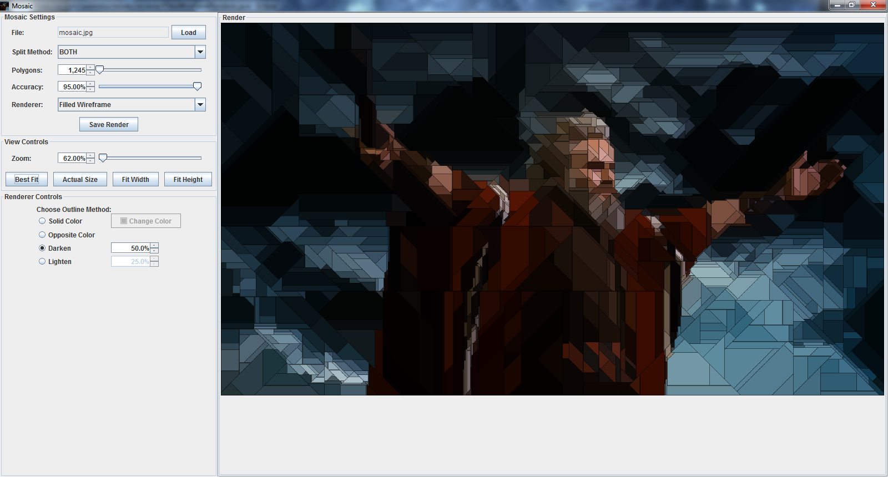

SpeedClueContest
================

Mosaic is a Java 8 application that enables users to generate mosaics of image
files.  It uses statistics and a few different types of splitting techniques to
break an image down into convex polygons.  Using the program is pretty simple:
load a file, play around with the splitting method, polygon count/accuracy, and
renderer until you get a result you like, then save it!

This program is incomplete and buggy (for example, regardless of what filename
you give your saved images, the application will save it as a PNG), but it runs
without any errors (so far as I know).  I am about to start classes again and
have a busy schedule, so I wanted to make what I have done available so anyone
who is interested can play around with it.

All my work is intended to be free to use and modify as you see fit.  If I have
time in the near future between classes, I intend to put the MIT license in the
files as I clean it up.  That said, if you use this program to generate any
pictures that you use in some noticeable way, or if you use this codebase to
launch your own projet, I would appreciate kudos.

If you have any ideas for improvements, please contact me at jac@sadakatsu.com .
My major focus was on writing an application that would allow me to explore the
mosaic algorithm results; I am by no means familiar with Java best practices.
Any input on improvements (especially in terms of architecture) are greatly
appreciated!